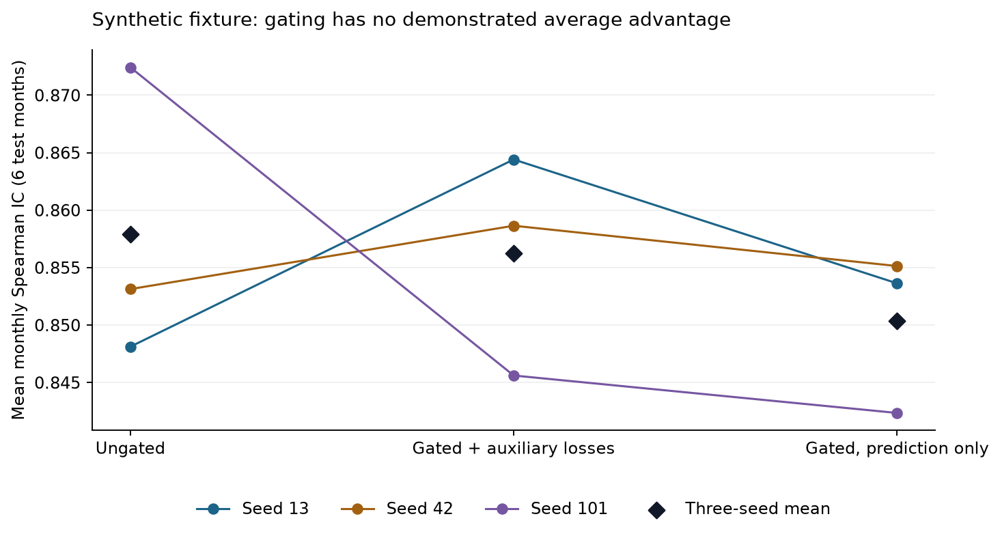

# Engineering study — September 14, 2026

**Scope:** correctness and reproducibility of a course-project research pipeline. No
original market dataset was available, so this study does not establish financial alpha
or rehabilitate the historical Sharpe/drawdown claims.

## What changed

The [evaluation audit](evaluation-audit.md) documents the root causes and fixes. The main
changes are monthly data validation; signed-weight rebalancing and explicit costs; initial
capital in drawdown; finite singleton-batch losses; best-epoch restoration; an active
feature-gating path; self-contained TFA inference checkpoints; consistent analysis scaling;
and one shared configuration/experiment runner with visible failures and bounded caching.

Five existing regression tests passed before this second pass. Added accounting/panel cases
initially produced 14 failures and one error; added model/rolling cases reproduced nine
failures and two errors. Those behaviors now pass. The maintained test suite additionally
runs all five models, compares date/asset coverage, checks exact repeated-seed predictions,
reloads checkpoints, verifies CLI precedence, and checks process failure semantics.
The 43-test locked-environment suite also passes scoped Ruff and Pyright checks.

## Controlled experiment protocol

Generate the fixture using `python -m scripts.generate_fixture`. Its data RNG seed is 2026;
it has 20 months, 20 assets and three synthetic features. Each feature follows an AR-like
process, and returns depend on the previous month's first two features plus an interaction
with the third. The label includes independent noise. This intentionally learnable process
is not calibrated to a market.

All runs use three input months, eight training-label months, three disjoint validation-label
months and six test months (March–August 2011): 120 predictions per model. TFA uses model
width 16, two heads, one encoder and decoder layer, three latent dimensions, five classes,
no dropout, batch size 32, learning rate .002, at most 12 epochs and patience five.
The full auxiliary weights are alpha=.1, beta=.05 and gamma=.01. Stopping uses validation
prediction cross-entropy. CPU, one thread; rolling seeds are base seed + roll index.

The baseline comparison uses seed 42. The ablation protocol declares seeds 13, 42 and 101
and reports all three variants: ungated, gated, and gated with auxiliary weights zero.
The ungated graph still benefits from all correctness fixes. It does not reproduce the
buggy historical experiments. No configuration is retuned after seeing these test results.

The final run used clean committed source [`079e923`](https://github.com/LambertAlpha/Alpha-Hunter/commit/079e923c6a2165aee1dd7b50ad900720dfffbcc7).
All 14 experiments completed all six months: **84 fitted rolling models and 1,680
prediction rows**. All five baseline prediction files exactly match the earlier controlled
run after the final cleanup; no result was discarded. The source commit also passed
[Linux CI](https://github.com/LambertAlpha/Alpha-Hunter/actions/runs/34830468624), including
43 tests, scoped lint and type checks. Local locked-environment checks passed on macOS.

[Machine-readable evidence](../report/engineering_2026_09_14/README.md) includes effective
configurations, source/data hashes, every split status, predictions, portfolios and metrics.

| Model (seed 42) | Mean IC | Valid test months |
| --- | ---: | ---: |
| ridge | 0.8206 | 6 |
| random_forest | 0.8133 | 6 |
| mlp | 0.5825 | 6 |
| transformer | 0.7654 | 6 |
| tfa | 0.8586 | 6 |

| Base seed | Ungated | Gated + auxiliaries | Gated, prediction only |
| --- | ---: | ---: | ---: |
| 13 | 0.8481 | 0.8644 | 0.8536 |
| 42 | 0.8531 | 0.8586 | 0.8551 |
| 101 | 0.8724 | 0.8456 | 0.8424 |
| Mean | 0.8579 | 0.8562 | 0.8504 |

Two seeds improve with gating and one degrades; the three-seed average is slightly lower.
**This does not demonstrate an average predictive advantage from the gate.** The gate
repairs the disconnected mechanism; keeping it as the default is a design choice consistent
with the described model, not a test-set performance selection. The ungated switch remains
an explicit ablation.

## Interpretation and next research questions

1. **Fixing implementation validity is the strongest improvement here.** A prettier README
   or a larger Transformer would not repair rank returns, hidden failed months or costs.
2. **The architecture needs a sharper research hypothesis.** Full encoded memory reaches
   the decoder, so reconstruction does not show that the small latent vector is sufficient.
   A future comparison could distinguish sequence reconstruction from a true bottleneck,
   holding parameter count and stopping criteria constant.
3. **Weights are not causal attribution.** Gradients and interventions establish participation
   in computation. They do not identify economic factors or establish predictive usefulness.
   The old concentration diagnostic no longer labels concentration a “momentum signal.”
4. **Simple baselines deserve equal status.** Ridge and random forest learn this constructed
   signal well. Any real-data claim should survive these baselines, matched coverage, seeds,
   transaction/borrow costs and an untouched final holdout.
5. **Upstream data remains the main research dependency.** Audit PCA fit dates/component
   alignment, universe membership, delisting/label omissions and execution timing before
   interpreting a market backtest. Absent labels and asset selection can bias results even
   when the code uses strictly preceding feature dates.

No statistical significance is claimed from six test months or three seeds. Synthetic
annualized Sharpe can be very large by construction and is only an accounting diagnostic;
it is not a useful headline result for an application.
