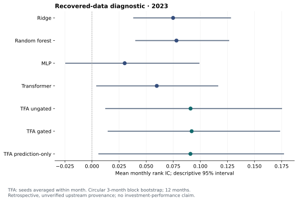

# Recovered-data diagnostic — September 2026

**Completed:** 13 runs, 156 rolling fits and 58,617 predictions over January–December
2023. Every run uses the same 4,509 date/asset observations. No months are skipped,
and all eligible training, validation and test returns are observed.

This is a retrospective diagnostic using recovered project features and a separate
coursework return panel. It is **not** a reproduction of the 2025 paper, an untouched
holdout, or validated investment performance. Upstream point-in-time provenance
remains incomplete. See the [data audit](../../docs/recovered-data-audit-2026-09-14.md).

## Results

| Model / variant | Seeds | Mean monthly IC | Seed range |
| --- | ---: | ---: | --- |
| Ridge | 1 | 0.07485 | single base seed 42 |
| Random forest | 1 | 0.07795 | single base seed 42 |
| MLP | 1 | 0.03017 | single base seed 42 |
| Transformer | 1 | 0.05979 | single base seed 42 |
| TFA ungated | 3 | 0.09098 | 0.08594–0.10043 |
| TFA gated | 3 | 0.09199 | 0.07311–0.12074 |
| TFA prediction-only | 3 | 0.09087 | 0.07215–0.11921 |

IC is the monthly Spearman correlation between model scores and realized stock
returns, not a return percentage. TFA means average all three declared seeds.
Baseline models use one seed; capacity and training objectives differ across
families. These numbers do not alone establish architectural superiority.

## What the experiment supports

The gated TFA mean exceeds the ungated mean by only **0.00101 IC**. Its paired
seed effects are **−0.00382, −0.01346 and +0.02032**: the apparent direction changes
with initialization. The descriptive month-block interval is **[−0.00377, +0.00485]**.
The gate is an executable architecture option, but this diagnostic does not support
advertising it as a stable predictive improvement.

All auxiliary objectives together add **0.00112 IC** over gated prediction-only
TFA on average. The three seed differences are small and positive, but the
month-block interval is **[−0.00865, +0.01110]**. This is insufficient evidence of a
persistent auxiliary-loss benefit. Neither test is confirmatory, and there is no
multiple-comparison correction. Validation checkpoint selection uses the same
prediction cross-entropy across the three TFA variants.

The best single gated seed is not an appropriate headline. It is especially
misleading to select that seed, compare it with a baseline's single run, and
present the gap as an architectural gain. All declared seeds are retained here.
No defaults or hyperparameters were changed to chase these evaluation scores.

The experiment improves traceability of the research pipeline; it does not repair
unverified upstream feature timing, establish the original paper's performance,
or validate investment returns. Twelve retrospective months and one conditional
stock universe cannot establish broad generalization. The [data audit](../../docs/recovered-data-audit-2026-09-14.md)
details the remaining assumptions and the next evidence needed.

## Verification and artifacts

- Runtime: [`37a56d2`](https://github.com/LambertAlpha/Alpha-Hunter/commit/37a56d2872095ca07af790e3ab786bffa51c8520),
  clean working tree recorded for every run. [Linux CI](https://github.com/LambertAlpha/Alpha-Hunter/actions/runs/34899290034)
  passed; 63 tests, Ruff and Pyright also passed locally.
- All 156 monthly ICs were independently recomputed with SciPy. Date/asset/return
  keys and runtime source hashes match across all 13 runs.
- Serial and parallel fixture predictions match exactly. All 4,509 real-data
  Ridge predictions also match the initial sequential run exactly.
- Restoring gated TFA (base seed 13) and loading features only through November
  2023 reproduces all 424 December predictions without labels; maximum absolute
  difference is 5.56e-17 (CSV roundoff).
- [verification.json](verification.json): source/data hashes, package versions,
  effective configs with private paths replaced, model sizes and inference checks.
- [monthly_ic.csv](monthly_ic.csv), [comparison.csv](comparison.csv),
  [summary.json](summary.json), [paired_comparisons.json](paired_comparisons.json):
  every declared result and paired diagnostic.
- [split_coverage.csv](split_coverage.csv), [data_audit.json](data_audit.json):
  temporal splits, sample counts and recovered-file provenance.
- [Reproduction commands](../../docs/reproducibility.md#recovered-data-diagnostic-september-2026).
  Required market inputs and security-level predictions remain private; input hashes
  do not substitute for access rights or verified point-in-time records.

## Design declared before model evaluation

- Frozen PCA: fit all 203 cleaned features from January 2007 through December 2008 only;
  hard cap 10 components and report, rather than assume, the 80% variance target.
  Export January 2009–November 2023 scores in this single basis. No additional scaling,
  winsorization or pseudo-industry neutralization. The cleaned inputs are already normalized.
- Monthly targets: January–December 2023; 12 preceding feature months; 36 training-label
  months and six subsequent validation-label months. No forward-fill. All eligible
  test returns must be observed. Models may learn from earlier 2023 months as time advances.
- Four baselines at base seed 42: Ridge, random forest, MLP and Transformer. Three TFA
  variants (ungated, gated and gated prediction-only) at base seeds 13, 42, 101. This
  produces 13 runs and 156 independent monthly fits. Rolling seeds add the calendar offset
  to the base seed, identically across paired variants. Hyperparameters are in [protocol.json](protocol.json).
- Neural models use width 16, at most 10 epochs and batches of 512. Transformer/TFA
  early stopping uses validation loss and patience 3; MLP trains all 10 epochs.
  This is a modest-compute comparison, not equal-capacity models or an exhaustive search.
- Report all monthly IC values, all seeds and paired month-level differences. A circular
  three-month block bootstrap (20,000 draws, seed 2026) describes uncertainty after averaging
  paired seeds within each month. Twelve months do not establish generalization.
- No parameter/model selection on these evaluation scores. 2023 appeared in the historical
  project, so it cannot become an untouched holdout through this new protocol. No 2024
  model comparison is run here. Portfolio and Sharpe output is explicitly disabled.

Raw/processed data, security-level predictions and model checkpoints stay local while
redistribution rights remain unverified. Aggregate diagnostics and reproducible code may
be shared, with the data hashes and unresolved assumptions stated explicitly.

Execution uses `--workers 4` to run independent experiments in separate spawned
processes, with each experiment retaining the declared single-thread settings.
Serial/parallel regression checks require exact equality of every prediction.
The initial sequential attempt was stopped for execution scheduling; its partial
outputs remain local and are not merged into the complete parallel matrix.
